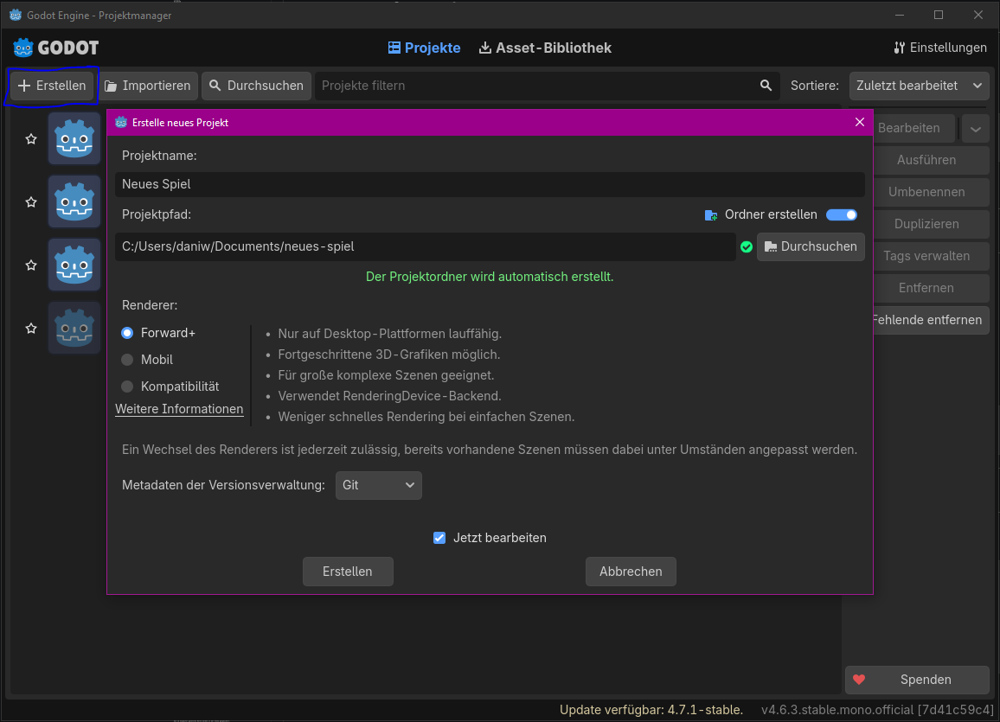
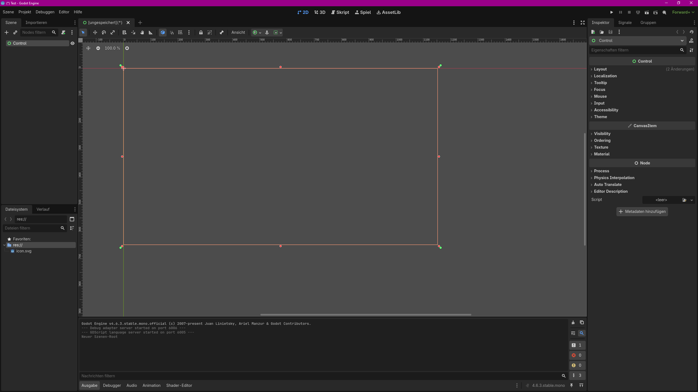

# Godot-Grundlagen: Editor, Nodes und Szenen

[Zurück zum Inhaltsverzeichnis](#inhaltsverzeichnis)

---

## Lernziele

Nach dieser Einheit kannst du:

- ein neues Godot-Projekt mit C# erstellen,
- die wichtigsten Bereiche des Godot-Editors unterscheiden,
- erklären, was ein Node ist,
- erklären, was eine Szene ist,
- einen einfachen Scene Tree aufbauen,
- Eigenschaften eines Nodes im Inspector verändern,
- eine Szene speichern und starten,
- zwischen einer Szene und den Dateien im Projekt unterscheiden.

---

# 1. Was ist Godot?

Godot ist eine Game Engine.

Mit einer Game Engine können unter anderem folgende Bestandteile eines Spiels erstellt und verwaltet werden:

- Szenen
- Spielfiguren
- Benutzeroberflächen
- Animationen
- Sounds
- Eingaben
- Kollisionen
- Spielregeln
- Speichersysteme

In dieser Unterrichtsreihe verwenden wir:

```text
Godot mit C#
```

---

# 2. Godot mit C#

Für ein Godot-Projekt mit C# wird die **Godot-.NET-Version** benötigt.

https://godotengine.org/download/windows/

Godot erstellt dabei zusätzlich eine C#-Projektdatei:

```text
Projektname.csproj
```

Diese Datei gehört zum C#-Projekt und wird von Godot beziehungsweise .NET benötigt.

---

# 3. Ein neues Projekt erstellen

1. Godot starten.
2. Im Project Manager **Create** auswählen.
3. Projektname und Speicherort festlegen.
4. Darauf achten, dass die .NET-Version von Godot verwendet wird.
5. Projekt erstellen und öffnen.


Beispiel:

```text
Project Name: FirstGodotProject
```

---

# 4. Wichtige Bereiche des Editors

Für den Einstieg sind vor allem diese Bereiche wichtig:

```text
Scene
FileSystem
Inspector
Viewport
Output
```

## 4.1 Scene

Im Bereich **Scene** wird der aktuelle Scene Tree angezeigt.

```text
Main
├── TitleLabel
├── StatusLabel
└── StartButton
```

Hier sieht man:

- alle Nodes der geöffneten Szene,
- welcher Node der Root Node ist,
- welche Nodes untergeordnet sind,
- wie die Nodes hierarchisch zusammengehören.

Der Scene Tree zeigt nur den Aufbau der aktuell geöffneten Szene.

## 4.2 FileSystem

Im **FileSystem** werden die Dateien und Ordner des Projekts angezeigt.

Beispiele:

```text
Scenes/
Scripts/
Assets/
Images/
Audio/
```

Typische Dateien:

```text
Main.tscn
Main.cs
icon.svg
project.godot
```

## 4.3 Inspector

Im **Inspector** werden die Eigenschaften des ausgewählten Nodes angezeigt.

Beispiele:

```text
Text
Position
Size
Visible
Disabled
Modulate
```

Wird ein anderer Node im Scene Tree ausgewählt, zeigt der Inspector dessen Eigenschaften.

## 4.4 Viewport

Im **Viewport** wird die Szene sichtbar bearbeitet.

Für unsere ersten Projekte verwenden wir hauptsächlich:

```text
2D
```

Im 2D-Viewport können Nodes zum Beispiel:

- ausgewählt,
- verschoben,
- skaliert,
- angeordnet

werden.

## 4.5 Output

Im Bereich **Output** erscheinen später:

- Programmausgaben,
- Warnungen,
- Fehlermeldungen,
- Debug-Informationen.

Beispiel für später:

```csharp
GD.Print("Hallo Godot!");
```

---

# 5. Scene Tree und FileSystem unterscheiden

## Scene Tree

Zeigt die aktuell zusammengesetzten Objekte:

```text
Main
├── Label
└── Button
```

## FileSystem

Zeigt die gespeicherten Dateien:

```text
Scenes/Main.tscn
Scripts/Main.cs
Assets/icon.svg
```

> Der Scene Tree zeigt Objekte der aktuellen Szene.  
> Das FileSystem zeigt Dateien und Ordner des Projekts.

---

# 6. Was ist ein Node?

Ein Node ist ein einzelner Baustein in Godot.

Beispiele:

```text
Node
Node2D
Control
Label
Button
Sprite2D
Camera2D
AudioStreamPlayer
```

Jeder Node besitzt:

- einen Typ,
- einen Namen,
- Eigenschaften,
- mögliche Methoden,
- mögliche Signale,
- optional untergeordnete Nodes.

Beispiel:

```text
StartButton = Name der konkreten Node-Instanz
Button      = Typ beziehungsweise Klasse
```

Vergleich mit C#:

```csharp
Button startButton = new Button();
```

---

# 7. Was ist eine Szene?

Eine Szene ist ein Baum aus Nodes.

```text
Main
└── VBoxContainer
    ├── TitleLabel
    ├── StatusLabel
    └── StartButton
```

Die Szene besitzt genau einen obersten Node:

```text
Main
```

Dieser Node wird als **Root Node** bezeichnet.

Eine Szene kann einen ganzen Bildschirm oder nur ein einzelnes wiederverwendbares Objekt darstellen.

Beispiele:

```text
MainMenu
Player
Door
Chest
InventorySlot
```

> Ein Node ist ein einzelner Baustein.  
> Eine Szene ist ein gespeicherter Baum aus Nodes.

---

# 8. Root Node

Jede Szene benötigt einen Root Node.

Häufige Root Nodes:

## Node

Geeignet für:

- zentrale Logik,
- Manager,
- übergeordnete Struktur.

## Node2D

Geeignet für:

- Räume,
- bewegliche Objekte,
- sichtbare 2D-Elemente.

## Control

Geeignet für:

- Menüs,
- Buttons,
- Labels,
- Inventare,
- Einstellungsfenster.

## CharacterBody2D

Geeignet für bewegliche Spielfiguren mit Kollisionen.

Dieser Node wird später genauer behandelt.

---

# 9. Parent Nodes und Child Nodes

```text
Main
└── MenuContainer
    ├── TitleLabel
    └── StartButton
```

Dabei gilt:

```text
Main          = Parent von MenuContainer
MenuContainer = Child von Main
```

Außerdem:

```text
MenuContainer = Parent von TitleLabel und StartButton
TitleLabel    = Child von MenuContainer
StartButton   = Child von MenuContainer
```

Die Hierarchie zeigt:

- welche Nodes zusammengehören,
- welches Objekt ein anderes enthält,
- wie Nodes später über Pfade gefunden werden,
- welche Nodes gemeinsam entfernt oder verschoben werden können.

---

# 10. Node hinzufügen

1. Im Scene Tree einen Node auswählen.
2. Auf **Add Child Node** / Auf das **+** klicken.
3. Nach einem Node-Typ suchen.
4. Node erstellen.

Der neue Node wird als Child des ausgewählten Nodes eingefügt.

---

# 11. Node umbenennen

Ungünstig:

```text
Label
Label2
Button
Button2
```

Besser:

```text
TitleLabel
StatusLabel
StartButton
ResetButton
```

Für Node-Namen verwenden wir:

```text
PascalCase
```

---

# 12. Erste Szene erstellen

Erstelle eine neue **User Interface Scene**.

Als Root Node wird ein `Control` erstellt.

Benenne den Root Node um:

```text
Main
```

Füge danach einen `VBoxContainer` hinzu.

Unter dem `VBoxContainer` werden folgende Nodes erstellt:

```text
Main
└── VBoxContainer
    ├── TitleLabel
    ├── StatusLabel
    ├── ActionButton
    └── ResetButton
```

---

# 13. Verwendete Node-Typen

## Control

Grundlage der Benutzeroberfläche.

## VBoxContainer

Ordnet seine Child Nodes automatisch vertikal untereinander an.

## Label

Zeigt Text an.

## Button

Kann von einem Benutzer gedrückt werden.

Die Programmierung der Buttons folgt in einer späteren Unterlage.

---

# 14. Texte im Inspector einstellen

## TitleLabel

```text
Erste Godot-Anwendung
```

## StatusLabel

```text
Noch keine Aktion ausgeführt
```

## ActionButton

```text
Aktion ausführen
```

## ResetButton

```text
Zurücksetzen
```

---

# 15. Szene speichern

Eine Szene wird als `.tscn`-Datei gespeichert.

Beispiel:

```text
Main.tscn
```

Empfohlener Speicherort:

```text
Scenes/Main.tscn
```

Beispielhafte Projektstruktur:

```text
FirstGodotProject/
├── Scenes/
│   └── Main.tscn
├── Scripts/
├── Assets/
├── FirstGodotProject.csproj
└── project.godot
```

---

# 16. Szene und Projekt starten

Godot unterscheidet zwischen:

```text
aktuelle Szene starten
Projekt starten
```

## Aktuelle Szene starten

```text
F6
```

Dabei wird nur die aktuell geöffnete Szene gestartet.

## Projekt starten

```text
F5
```

Dabei wird die festgelegte Main Scene gestartet.

Falls noch keine Main Scene festgelegt wurde, wähle:

```text
Scenes/Main.tscn
```

> F6 startet die aktuelle Szene.  
> F5 startet das gesamte Projekt über die Main Scene.

---

# 17. Main Scene

Die Main Scene ist die Szene, mit der das Projekt startet.

Für unser erstes Projekt verwenden wir:

```text
Main.tscn
```

---

# 18. Änderungen im Inspector

Die im Inspector gesetzten Werte werden in der Szene gespeichert.

Beispiel:

```text
ActionButton.Text = "Aktion ausführen"
```

Der Wert gehört zur konkreten Button-Instanz in `Main.tscn`.

Eine andere Button-Instanz kann einen anderen Text besitzen.

---

# 19. Szene als Vorlage

Eine gespeicherte Szene kann später in andere Szenen eingefügt werden.

Beispiel:

```text
Door.tscn
```

kann in mehreren Räumen verwendet werden:

```text
LivingRoom.tscn
Bedroom.tscn
Basement.tscn
```

Jede eingefügte Tür ist eine eigene Instanz derselben gespeicherten Szene.

Dieses Thema wird später genauer behandelt.

---

# 20. Übung im Unterricht

Erstelle folgende Szene:

```text
Main
└── VBoxContainer
    ├── TitleLabel
    ├── DescriptionLabel
    ├── StatusLabel
    ├── ActionButton
    └── ResetButton
```

Verwende folgende Texte:

```text
TitleLabel:
Godot mit C#

DescriptionLabel:
Meine erste Benutzeroberfläche

StatusLabel:
Bereit

ActionButton:
Start

ResetButton:
Zurücksetzen
```

## Anforderungen

- Root Node ist ein `Control`.
- Der Root Node heißt `Main`.
- Die UI-Elemente befinden sich in einem `VBoxContainer`.
- Alle Nodes besitzen aussagekräftige Namen.
- Die Szene wird unter `Scenes/Main.tscn` gespeichert.
- `Main.tscn` wird als Main Scene festgelegt.
- Die Szene lässt sich mit `F6` starten.
- Das Projekt lässt sich mit `F5` starten.

---

# 21. Kontrollfragen

1. Was ist ein Node?
2. Was ist eine Szene?
3. Was ist der Root Node?
4. Was zeigt der Scene Tree?
5. Was zeigt das FileSystem?
6. Wofür wird der Inspector verwendet?
7. Was ist der Unterschied zwischen `Label` und `TitleLabel`?
8. Was ist ein Parent Node?
9. Was ist ein Child Node?
10. Was ist der Unterschied zwischen `F5` und `F6`?
11. Was ist eine Main Scene?
12. Welche Dateiendung besitzt eine Godot-Szene?

---

# 22. Kurzüberblick

| Begriff | Bedeutung |
|---|---|
| Node | Einzelner Baustein |
| Szene | Gespeicherter Baum aus Nodes |
| Root Node | Oberster Node einer Szene |
| Parent | Übergeordneter Node |
| Child | Untergeordneter Node |
| Scene Tree | Aufbau der aktuellen Szene |
| FileSystem | Dateien und Ordner des Projekts |
| Inspector | Eigenschaften des ausgewählten Objekts |
| Viewport | Sichtbarer Arbeitsbereich |
| Output | Ausgaben, Warnungen und Fehler |
| `.tscn` | Dateiendung einer Godot-Szene |
| `F5` | Gesamtes Projekt starten |
| `F6` | Aktuelle Szene starten |

---

# Merksätze

> Nodes sind die Bausteine eines Godot-Projekts.

> Mehrere hierarchisch angeordnete Nodes bilden eine Szene.

> Jede Szene besitzt genau einen Root Node.

> Der Scene Tree zeigt die Objekte der aktuellen Szene.

> Das FileSystem zeigt die gespeicherten Dateien des Projekts.

> Der Inspector zeigt und verändert die Eigenschaften eines ausgewählten Nodes.

> Mit `F5` wird das Projekt und mit `F6` die aktuelle Szene gestartet.

---

# Quellen

- https://docs.godotengine.org/en/stable/getting_started/introduction/first_look_at_the_editor.html
- https://docs.godotengine.org/en/stable/getting_started/step_by_step/nodes_and_scenes.html
- https://docs.godotengine.org/en/stable/tutorials/scripting/c_sharp/c_sharp_basics.html
